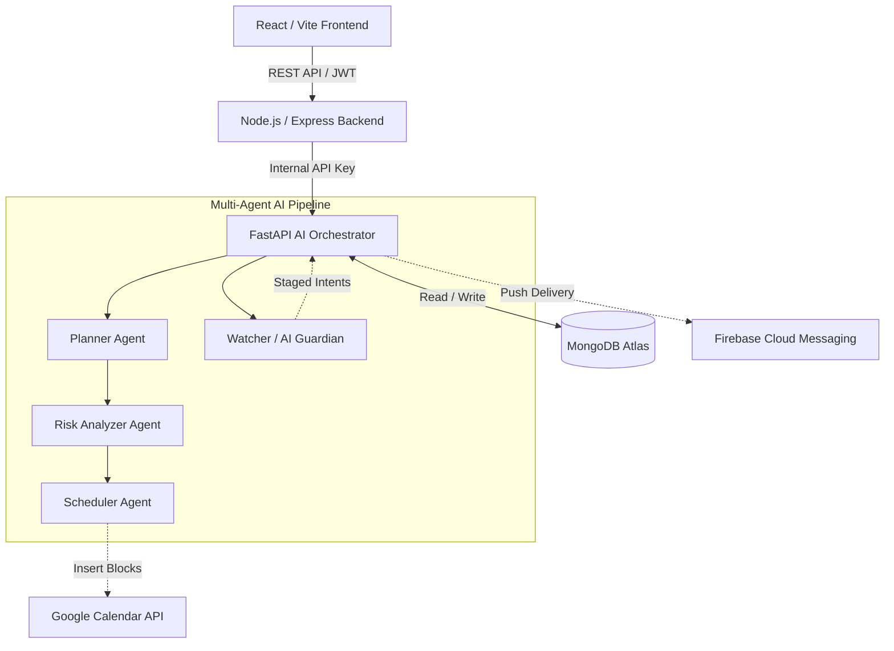

# Last-Minute Life Saver ⏱️

**The Ultimate AI-Powered Rescue System for Overwhelmed Professionals and Students.**

Last-Minute Life Saver is a multi-agent AI scheduling ecosystem that takes your scattered, overwhelming pile of to-dos and instantly transforms them into a mathematically optimized, realistic, and stress-free calendar.

## The Problem
When deadlines loom, cognitive overload sets in. Traditional task managers require *you* to figure out how long things take, when to do them, and how to recover when you inevitably miss a deadline. 

## The Solution
An autonomous multi-agent system that:
1. **Plans**: Breaks massive goals into Pomodoro-sized bites.
2. **Analyzes**: Detects impossible deadlines and calculates risk scores.
3. **Schedules**: Tetris-fits tasks perfectly into your Google Calendar.
4. **Guards**: An emotionally intelligent background watcher that nudges you and instantly reschedules if a calendar conflict arises.

---

## System Architecture



## Explainable AI (XAI)
We believe AI shouldn't be a black box. Every single AI decision in this application includes a `whyAmISeeingThis` human-readable explanation, a `confidence` score, and explicit `reasoning` traces visible in the UI.

## Tech Stack
* **Frontend**: React, Vite, TypeScript
* **Backend API**: Node.js, Express
* **AI Orchestrator**: Python, FastAPI, Gemini API
* **Database**: MongoDB Atlas
* **Integrations**: Google Calendar API, Firebase Cloud Messaging

## Quickstart

## Setup

1. Copy each .env.example to .env.
2. Fill in their own Firebase, MongoDB, and Gemini credentials.
3. Start the frontend, backend, and AI orchestrator.

### 1. Database & AI
Ensure you have a MongoDB instance running and a Google Gemini API Key. Populate your `.env` files using the `.env.example` templates.

### 2. AI Orchestrator (Backend)
```bash
cd ai-orchestrator
python -m venv .venv
source .venv/bin/activate  # On Windows: .\.venv\Scripts\Activate.ps1
pip install -r requirements.txt
uvicorn app.main:app --reload
```

### 3. Node Backend
```bash
cd backend
npm install
npm run dev
```

### 4. React Frontend
```bash
cd frontend
npm install
npm run dev
```

## Demo Seed Data
To populate the database with hackathon-ready demo personas (Student, Founder, Engineer), run:
```bash
cd ai-orchestrator
python scripts/seed_demo_data.py
```
