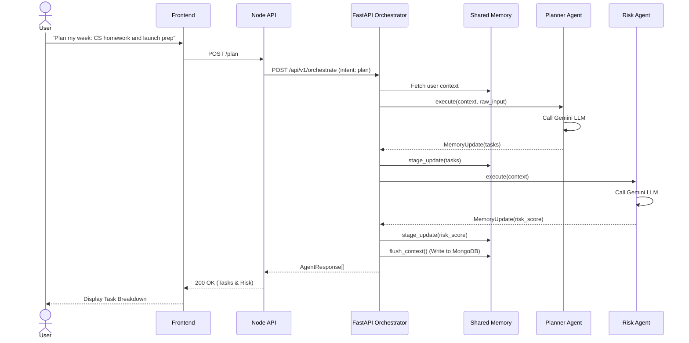
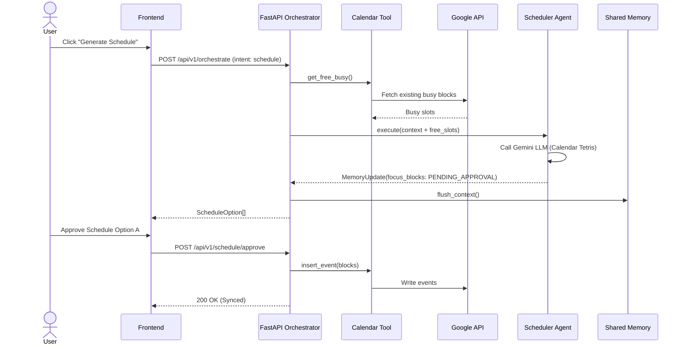
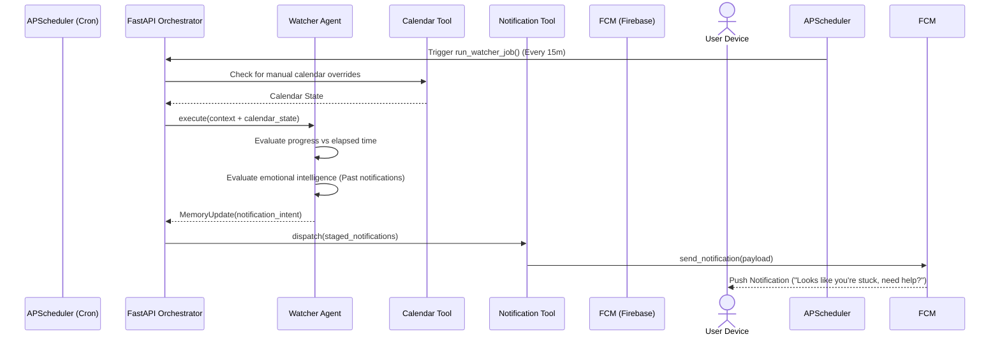

# System Sequence Diagrams

These Mermaid sequence diagrams map out the critical paths for the AI Orchestrator.

## 1. Task Planning Flow
This flow handles the initial breakdown of raw user input into actionable, risk-analyzed tasks.

## 2. Scheduler Flow
This flow maps approved tasks to actual calendar time blocks.

## 3. Watcher Notification Flow (AI Guardian)
This background flow monitors the user and dispatches intelligent nudges via Firebase.

